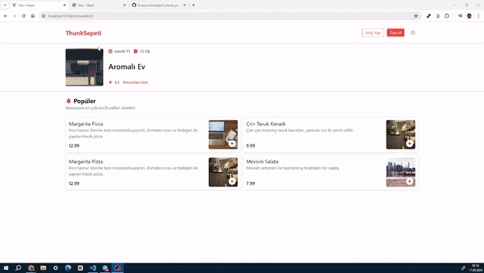

# Restaurant Website

Bu proje, Redux Toolkit kullanmadan önce React'te durum yönetimi için Redux'u anlamak amacıyla geliştirilmiştir. Proje, bir restoranın online sipariş sistemini simüle etmektedir.Yemek sepetinden esinlendim. Aşağıda kullanılan bağımlılıklar ve proje hakkında daha fazla bilgi bulabilirsiniz.

## Kullanılan Bağımlılıklar

- **Json Server**: Bir REST API'sini simüle etmek için kullanılan bir araç.
- **React Router DOM**: Sayfa yönlendirme ve rotalama işlemleri için kullanılan bir kütüphane.
- **Axios**: HTTP istekleri yapmak için kullanılan bir JavaScript kütüphanesi.
- **Tailwind CSS**: CSS çatışmalarını önlemek ve hızlı bir şekilde stil uygulamak için kullanılan bir CSS çerçevesi.
- **UUID**: Benzersiz kimlikler oluşturmak için kullanılan bir kütüphane.

### REDUX-THUNK
- Redux-Thunk kullanımı, asenkron işlemleri Redux üzerinde yönetmek için kullanılan bir middleware'dir. Özellikle Redux kullanarak asenkron işlemler gerçekleştirmek istediğinizde, Redux-Thunk sıklıkla tercih edilen bir araçtır. Redux-Thunk, Redux'un action creator'larına ve reducer'larına işlevsellik eklemek için kullanılır.

- Redux Toolkit kullanmadan önce Redux-Thunk kullanımı oldukça yaygındı. Redux-Thunk, Redux'a async action creator'lar eklemek için kullanılır ve bu şekilde Redux'ta asenkron işlemleri yönetmek için bir çözüm sunar.
## Proje Açıklaması

Bu proje, Redux Toolkit kullanmadan önce React ile Redux arasındaki etkileşimi anlamak amacıyla geliştirilmiştir.Redux Toolkit kullanılmadan önce Redux-Thunk kullanarak asenkron işlemleri yönetiyor ve işlevini anlıyor olabilmeniz gerekli.Kısaca Redux-Thunk, özellikle HTTP istekleri gibi asenkron işlemler için kullanışlıdır.  Temel olarak, bir restoranın online sipariş sistemi için bir kullanıcı arayüzü sunar. Json Server kullanılarak oluşturulan sahte bir API üzerinden restoran menüsüne göz atılabilir, ürünler sepete eklenebilir ve siparişler tamamlanabilir. React Router DOM ile sayfalar arasında geçiş yapılabilir ve Axios ile gerçek bir API ile iletişim kurulabilir. Tailwind CSS, basit ve hızlı bir şekilde stil uygulamak için kullanılmıştır. UUID ise her bir ürünün benzersiz bir kimliğe sahip olmasını sağlamak için kullanılmıştır.

### Ekran Görüntüsü -mobile

### Ekran Görüntüsü 
